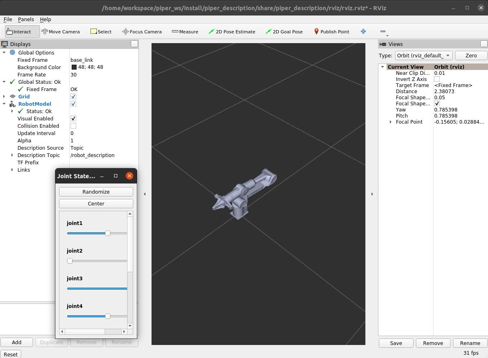

# piper 机械臂(humble)


[EN](README(EN).MD)

Test:

|PYTHON |STATE|
|---|---|
|||

## 1 安装方法

### 1.1 安装依赖

注: python-can版本应高于4.3.1

```shell
pip3 install python-can
pip3 install scipy
```

```shell
pip3 install piper_sdk
```

```shell
sudo apt install ros-$ROS_DISTRO-ros2-control
sudo apt install ros-$ROS_DISTRO-ros2-controllers
sudo apt install ros-$ROS_DISTRO-controller-manager
```

## 2 快速使用

### 2.1 使能can模块

#### 2.1.1 激活单个can模块, **此处使用`can_activate.sh`脚本**

##### 1) pc只插入一个usb转can模块

直接执行

```bash
bash can_activate.sh can0 1000000
```

##### 2) pc插入多个usb转can模块， 但每次只激活一个can模块

注： 此处用于同时使用机械臂和底盘的的情况

(1) 查看can模块插在usb端口的硬件地址。拔掉所有can模块，只将连接到机械臂的can模块插入PC，执行

```shell
sudo ethtool -i can0 | grep bus
```

并记录下`bus-info`的数值例如`1-2:1.0`

注：**一般第一个插入的can模块会默认是can0，如果没有查询到can可以使用`bash find_all_can_port.sh`来查看刚才usb地址对应的can名称**

(2) 激活can设备。假设上面的操作记录的`bus-info`数值为`1-2:1.0`，执行：

```bash
bash can_activate.sh can_piper 1000000 "1-2:1.0"
```

注：**1-2:1.0硬件编码的usb端口插入的can设备，名字被重命名为can_piper，波特率为1000000，并激活**

(3) 检查是否激活成功

执行`ifconfig`查看是否有`can_piper`，如果有则can模块设置成功

#### 2.1.2 同时激活多个can模块，**此处使用`can_config.sh`脚本**

##### 1) 逐个拔插can模块并一一记录每个模块对应的usb口硬件地址

在`can_config.sh`中，`EXPECTED_CAN_COUNT`参数为想要激活的can模块数量,现在假设为2

然后can模块中的其中一个单独插入PC，执行

```shell
sudo ethtool -i can0 | grep bus
```

并记录下`bus-info`的数值例如`1-2:1.0`

(2) 接着插入下一个can模块，注意**不可以**与上次can模块插入的usb口相同，然后执行

```shell
sudo ethtool -i can1 | grep bus
```

注：**一般第一个插入的can模块会默认是can0，第二个为can1，如果没有查询到can可以使用`bash find_all_can_port.sh`来查看刚才usb地址对应的can名称**

##### 2) 预定义USB 端口、目标接口名称及其比特率

假设上面的操作记录的`bus-info`数值分别为`1-2:1.0`、`1-4:1.0`，则将下面的`USB_PORTS["1-9:1.0"]="can_left:1000000"`的中括号内部的双引号内部的参数换为`1-2:1.0`和`1-4:1.0`.

最终结果为：

`USB_PORTS["1-2:1.0"]="can_right:1000000"`

`USB_PORTS["1-4:1.0"]="can_right:1000000"`

注：**1-2:1.0硬件编码的usb端口插入的can设备，名字被重命名为can_left，波特率为1000000，并激活**

##### 3) 看终端输出是否激活成功

执行`bash can_config.sh`

##### 4) 查看can是否设置成功

执行`ifconfig`查看是不是有`can_left`和`can_right`

### 2.2 运行节点

编译

```shell
colcon build
```

#### 2.2.1 单个机械臂

节点名`piper_single_ctrl`

param

```shell
can_port:要打开的can路由名字
auto_enable:是否自动使能，True则开启程序就自动使能
# 注意这个设置为False，中断程序后再启动节点，机械臂会保持上次启动程序的状态
# 若上次启动程序机械臂状态为使能，则中断程序后再启动节点，机械臂仍为使能
# 若上次启动程序机械臂状态为失能，则中断程序后再启动节点，机械臂仍为失能
girpper_exist:是否有末端夹爪，True则说明有末端夹爪，会开启夹爪控制
rviz_ctrl_flag:是否使用rviz来发送关节角消息，True则接收rviz发送的关节角消息
#由于rviz中的joint7范围是[0,0.04]，而真实夹爪行程为0.08m，打开rviz控制后会将rviz发出的joint7乘2倍
```

有两个启动单臂的launch文件`start_single_piper_rviz.launch.py` 和 `start_single_piper.launch.py`

前者是可以一起将rviz启动，然后可以拖动滑动条控制机械臂

启动控制节点

```shell
# 启动节点
ros2 run piper piper_single_ctrl --ros-args -p can_port:=can0 -p auto_enable:=false -p gripper_exist:=true -p rviz_ctrl_flag:=true
# 启动launch
ros2 launch piper start_single_piper.launch.py can_port:=can0 auto_enable:=false gripper_exist:=false rviz_ctrl_flag:=true
# 或，会以默认参数运行
ros2 launch piper start_single_piper.launch.py
# 也可以用rviz开启控制,需要更改的参数如上
ros2 launch piper start_single_piper_rviz.launch.py
```

`ros2 topic list`

```shell
/arm_status #机械臂状态，详见下文
/enable_flag #使能标志位，发送给节点，发送true用来使能
/end_pose #机械臂末端位姿状态反馈
/joint_states #订阅关节消息，给这个消息发送关节位置能控制机械臂运动
/joint_states_single #机械臂关节状态反馈
/pos_cmd #末端控制消息
```

ros2 service list

```shell
/enable_srv #机械臂使能服务端
```

使能机械臂

```shell
# call 服务端
ros2 service call /enable_srv piper_msgs/srv/Enable enable_request:\ true\ 
# pub topic
ros2 topic pub /enable_flag std_msgs/msg/Bool data:\ true\ 
```

失能机械臂

```shell
# call 服务端
ros2 service call /enable_srv piper_msgs/srv/Enable enable_request:\ false\ 
# pub topic
ros2 topic pub /enable_flag std_msgs/msg/Bool data:\ false\ 
```

发布关节消息

注意，机械臂会抬起，请确保机械臂工作范围内无障碍

机械臂会以默认速度的百分之10运动，夹爪力矩设定0.5N，位置如下

```shell
ros2 topic pub /joint_states sensor_msgs/msg/JointState "{header: {stamp: {sec: 0, nanosec: 0}, frame_id: 'piper_single'}, name: ['joint1', 'joint2','joint3','joint4','joint5','joint6','joint7'], position: [0.2,0.2,-0.2,0.3,-0.2,0.5,0.01], velocity: [0,0,0,0,0,0,10], effort: [0,0,0,0,0,0,0.5]}"

```

## 3 注意事项

- 需要先激活can设备，并且设置正确的波特率，才可以读取机械臂消息或者控制机械臂
- 如果出现

  ```shell
  使能状态: False
  <class 'can.exceptions.CanError'> Message NOT sent
  <class 'can.exceptions.CanError'> Message NOT sent
  ```

  说明机械臂没有与can模块连同，拔插usb后，重新启动机械臂，再激活can模块，然后尝试重新启动节点

- 如果打开了自动使能，尝试使能5s没有成功后，会自动退出程序

### 3.1 piper自定义消息

ros功能包`piper_msgs`

机械臂自身状态反馈消息，对应can协议中`id=0x2A1`的反馈消息

`PiperStatusMsg.msg`

```c
uint8 ctrl_mode
/*
0x00 待机模式  
0x01 CAN指令控制模式
0x02 示教模式
0x03 以太网控制模式
0x04 wifi控制模式
0x05 遥控器控制模式
0x06 联动示教输入模式
0x07 离线轨迹模式*/
uint8 arm_status
/*
0x00 正常
0x01 急停
0x02 无解
0x03 奇异点
0x04 目标角度超过限
0x05 关节通信异常
0x06 关节抱闸未打开 
0x07 机械臂发生碰撞
0x08 拖动示教时超速
0x09 关节状态异常
0x0A 其它异常  
0x0B 示教记录
0x0C 示教执行
0x0D 示教暂停
0x0E 主控NTC过温
0x0F 释放电阻NTC过温*/
uint8 mode_feedback
/*
0x00 MOVE P
0x01 MOVE J
0x02 MOVE L
0x03 MOVE C*/
uint8 teach_status
/*
0x00 关闭
0x01 开始示教记录（进入拖动示教模式）
0x02 结束示教记录（退出拖动示教模式）
0x03 执行示教轨迹（拖动示教轨迹复现）
0x04 暂停执行
0x05 继续执行（轨迹复现继续）
0x06 终止执行
0x07 运动到轨迹起点*/
uint8 motion_status
/*
0x00 到达指定点位
0x01 未到达指定点位*/
uint8 trajectory_num
/*0~255 (离线轨迹模式下反馈)*/
int64 err_code//故障码
bool joint_1_angle_limit//1号关节通信异常（0：正常 1：异常）
bool joint_2_angle_limit//2号关节通信异常（0：正常 1：异常）
bool joint_3_angle_limit//3号关节通信异常（0：正常 1：异常）
bool joint_4_angle_limit//4号关节通信异常（0：正常 1：异常）
bool joint_5_angle_limit//5号关节通信异常（0：正常 1：异常）
bool joint_6_angle_limit//6号关节通信异常（0：正常 1：异常）
bool communication_status_joint_1//1号关节角度超限位（0：正常 1：异常）
bool communication_status_joint_2//2号关节角度超限位（0：正常 1：异常）
bool communication_status_joint_3//3号关节角度超限位（0：正常 1：异常）
bool communication_status_joint_4//4号关节角度超限位（0：正常 1：异常）
bool communication_status_joint_5//5号关节角度超限位（0：正常 1：异常）
bool communication_status_joint_6//6号关节角度超限位（0：正常 1：异常）
```

机械臂末端位姿控制，注意:有些奇异点无法到达

`PosCmd.msg`

```c
float64 x
float64 y
float64 z
float64 roll
float64 pitch
float64 yaw
float64 gripper
int32 mode1
int32 mode2
```

## 4 使用仿真

打开rviz

```shell
ros2 launch piper_description display_xacro.launch.py
```

运行后会发布`/joint_states`,可以通过`ros2 topic echo /joint_states` 查看

同时会弹出两个页面如下，滑动条数值对应`/joint_states`数值，拖动滑动条可以改变其数值，rviz中的模型也会随动



### 4.1 gazebo

coming...

## 5 Q&A

1. 出现

```shell
colcon build
Starting >>> piper   
Starting >>> piper_control
Starting >>> piper_description
Starting >>> piper_msgs
Finished <<< piper [0.31s]                                                                                                              
--- stderr: piper_description                                                                                            
CMake Error at CMakeLists.txt:5 (find_package):
  By not providing "Findament_cmake.cmake" in CMAKE_MODULE_PATH this project
  has asked CMake to find a package configuration file provided by
  "ament_cmake", but CMake did not find one.

  Could not find a package configuration file provided by "ament_cmake" with
  any of the following names:

    ament_cmakeConfig.cmake
    ament_cmake-config.cmake

  Add the installation prefix of "ament_cmake" to CMAKE_PREFIX_PATH or set
  "ament_cmake_DIR" to a directory containing one of the above files.  If
  "ament_cmake" provides a separate development package or SDK, be sure it
  has been installed.


---
Failed   <<< piper_description [0.45s, exited with code 1]
Aborted  <<< piper_control [0.45s]
Aborted  <<< piper_msgs [0.45s]

Summary: 1 package finished [0.55s]
  1 package failed: piper_description
  2 packages aborted: piper_control piper_msgs
  3 packages had stderr output: piper_control piper_description piper_msgs
```

```shell
source /opt/ros/foxy/setup.bash
```

2. 

```shell
Starting >>> piper   
Starting >>> piper_control
Starting >>> piper_description
Starting >>> piper_msgs
Finished <<< piper [0.33s]                                                                                                              
Finished <<< piper_description [0.42s]                                                                                     
--- stderr: piper_control                                                               
CMake Error at CMakeLists.txt:7 (find_package):
  By not providing "Findcontroller_manager.cmake" in CMAKE_MODULE_PATH this
  project has asked CMake to find a package configuration file provided by
  "controller_manager", but CMake did not find one.

  Could not find a package configuration file provided by
  "controller_manager" with any of the following names:

    controller_managerConfig.cmake
    controller_manager-config.cmake

  Add the installation prefix of "controller_manager" to CMAKE_PREFIX_PATH or
  set "controller_manager_DIR" to a directory containing one of the above
  files.  If "controller_manager" provides a separate development package or
  SDK, be sure it has been installed.


---
Failed   <<< piper_control [0.80s, exited with code 1]
Aborted  <<< piper_msgs [3.28s]                               

Summary: 2 packages finished [3.38s]
  1 package failed: piper_control
  1 package aborted: piper_msgs
  1 package had stderr output: piper_control
```

```shell
sudo apt install ros-$ROS_DISTRO-ros2-control
sudo apt install ros-$ROS_DISTRO-ros2-controllers
sudo apt install ros-$ROS_DISTRO-controller-manager
```

3. 

```shell
 "package 'joint_state_publisher_gui' not found
```

```shell
sudo apt install ros-$ROS_DISTRO-joint-state-publisher-gui
```

4. 

```shell
sudo apt install ros-$ROS_DISTRO-robot-state-publisher
```

5. 

```shell
sudo apt install ros-humble-xacro
```
